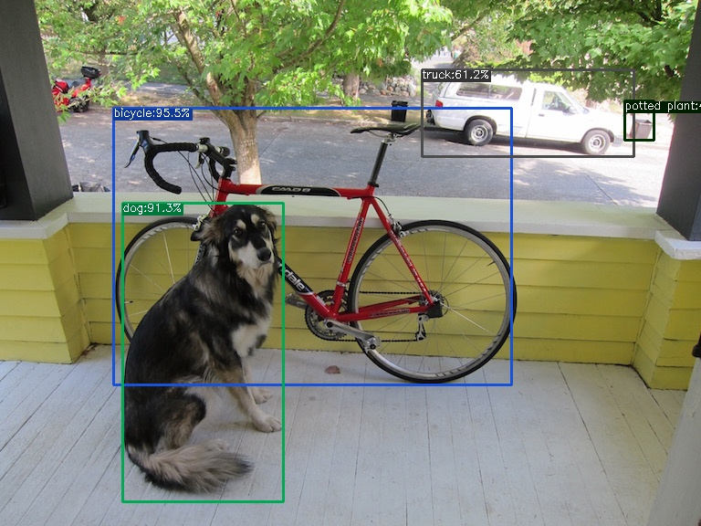

# Store Vision — Phase 1: YOLOX detection core (ONNX)

> Scope: **Phase 1 only** of the [build spec](docs/SPEC.md) — get YOLOX detecting
> **person / vehicle / box** objects and running through **ONNX Runtime**.
> Later phases (camera ingestion, zones/counting, theft rules, cloud, dashboard)
> are intentionally **not** built here.

Almost all detection in Store Vision comes from one model (YOLOX). This phase
stands that engine up and proves it end-to-end: PyTorch checkpoint → ONNX export
→ ONNX Runtime inference on a real image.

## Result

Running the exported model through the official YOLOX ONNX Runtime demo on
`assets/dog.jpg` detects (score ≥ 0.30):

| class        | confidence | Phase-1 relevant |
|--------------|-----------:|------------------|
| bicycle      | 0.9545     | ✅ vehicle       |
| dog          | 0.9131     | — (COCO class)   |
| truck        | 0.6119     | ✅ vehicle       |
| potted plant | 0.4388     | —                |

Annotated output: [`outputs/dog.jpg`](outputs/dog.jpg). The pipeline detects the
Phase-1 **vehicle** classes (bicycle, truck) with high confidence; `person` and
`box`/`packet` are the same COCO model with different classes kept (SPEC §3).



## Layout

```
.
├── docs/                       # full planning set — the source of truth
│   ├── PRD.md                  #   product requirements
│   ├── SPEC.md                 #   build spec (8 phases; Phase 1 is this repo)
│   ├── TRD.md                  #   engineering contract (perf, security, gates)
│   ├── FLOWS.md                #   app + software sequences
│   ├── DESIGN.md               #   UI/UX brief
│   ├── SCHEMA.md               #   Postgres/Supabase schema
│   └── IMPLEMENTATION.md       #   phased execution plan
├── requirements-phase1.txt     # explicit deps (NOT YOLOX/requirements.txt)
├── requirements-phase1.lock.txt# exact pinned versions used
├── scripts/
│   ├── setup_phase1.sh         # reproduces everything below, end to end
│   ├── run_inference.py        # ONNX inference + prints classes/scores
│   └── torch213_export_onnx.patch  # torch>=2.9 fix for YOLOX export script
├── models/
│   └── yolox_s.onnx            # exported model (git-ignored; setup script builds it)
├── outputs/
│   └── dog.jpg                 # annotated proof image (small stills stay tracked)
└── third_party/YOLOX/          # upstream clone (git-ignored)
```

## Reproduce

```bash
bash scripts/setup_phase1.sh
```

That script performs the steps below. To run them by hand:

### 1. Python 3.12 venv
```bash
python3.12 -m venv .venv && source .venv/bin/activate
python -m pip install --upgrade pip
```

### 2. Clone YOLOX
```bash
git clone --depth 1 https://github.com/Megvii-BaseDetection/YOLOX.git third_party/YOLOX
```

### 3. Install deps — **do NOT use YOLOX/requirements.txt**
It pins `onnx-simplifier==0.4.10`, which builds a C++ extension and fails
without cmake. We don't need it (we export with `--no-onnxsim`). Install an
explicit set instead, then the YOLOX package itself:
```bash
pip install -r requirements-phase1.txt
pip install --no-deps --no-build-isolation -e third_party/YOLOX
```
`--no-build-isolation` lets YOLOX's build backend see the torch we just
installed (otherwise it errors: *"torch is required for pre-compiling ops"*).

### 4. Pretrained checkpoint
```bash
curl -fSL -o models/yolox_s.pth \
  https://github.com/Megvii-BaseDetection/YOLOX/releases/download/0.1.1rc0/yolox_s.pth
```
Validated checkpoint sha256:
`f55ded7181e1b0c13285c56e7790b8f0e8f8db590fe4edb37f0b7f345c913a30`
(80 COCO classes; detects dog.jpg as bicycle/dog/truck).

### 5. Export to ONNX (skip onnx-simplifier)
```bash
PYTHONPATH=third_party/YOLOX python third_party/YOLOX/tools/export_onnx.py \
  --output-name models/yolox_s.onnx -n yolox-s -c models/yolox_s.pth --no-onnxsim
```

### 6. Run the official ONNX Runtime demo
YOLOX scripts need the repo root on `PYTHONPATH` or the import fails with
*"No module named yolox"*.
```bash
PYTHONPATH=third_party/YOLOX python third_party/YOLOX/demo/ONNXRuntime/onnx_inference.py \
  -m models/yolox_s.onnx -i third_party/YOLOX/assets/dog.jpg \
  -o outputs -s 0.3 --input_shape 640,640
```
Or use the helper that also prints the detected classes + scores:
```bash
PYTHONPATH=third_party/YOLOX python scripts/run_inference.py \
  --model models/yolox_s.onnx --image third_party/YOLOX/assets/dog.jpg --score 0.3
```

## Notes / deviations from a vanilla setup

- **`opencv-python-headless`** is used instead of `opencv-python`: identical API,
  but no `libGL`/GTK dependency, which suits a headless server. The demo only
  writes files (`cv2.imwrite`), so nothing GUI is lost.
- **torch ≥ 2.9 export fix**: YOLOX's `tools/export_onnx.py` calls the removed
  private `torch.onnx._export`, and newer torch defaults to the dynamo exporter
  (needs `onnxscript`). The patch in `scripts/` switches it to
  `torch.onnx.export(..., dynamo=False)` (legacy TorchScript exporter).
- **Extra deps** beyond the spec's list (`psutil`, `pycocotools`) are pulled in
  by YOLOX's import chain even for export/inference-only use.
- Large binaries (`*.pth`, `*.onnx`, the YOLOX clone, `.venv`, annotated `.mp4`s)
  are git-ignored to keep the repo light. `scripts/setup_phase1.sh` rebuilds the
  35 MB `models/yolox_s.onnx` end to end; small annotated `.jpg` proof stills
  (e.g. `outputs/dog.jpg`) stay tracked so results are directly inspectable.

## Video detection on real footage

`scripts/detect_video.py` runs the same ONNX pipeline over a video, keeping only
the Store Vision classes, drawing labelled boxes + confidence, writing an
annotated video, and printing a running per-class count.

```bash
PYTHONPATH=third_party/YOLOX python scripts/detect_video.py \
  --model models/yolox_s.onnx --video data/clip.mp4 \
  --output outputs/clip_annotated.mp4 --score 0.35
```

Kept classes: `person`, `car`, `truck`, `bus`, `motorcycle`, `bicycle`, and
box-like stand-ins (`suitcase`, `backpack`, `handbag`). COCO-80 has **no literal
"box"/"packet" class**, so boxy/parcel-shaped COCO classes stand in on the
pretrained model; real box/packet detection is the light fine-tuning the SPEC
calls out for later.

Result on a retail-store CCTV clip (1452 frames, 1270×720, from `data/clip.mp4`):

| class    | total detections | category |
|----------|-----------------:|----------|
| person   | 13,597           | person   |
| handbag  | 1,325            | box-like |
| backpack | 28               | box-like |
| suitcase | 6                | box-like |

(No vehicles — it's an indoor store.) A still is at
[`outputs/clip_sample_frame.jpg`](outputs/clip_sample_frame.jpg); the full
annotated video (`outputs/clip_annotated.mp4`) is regenerated locally by the
command above and is git-ignored.

A second clip — a gas station at night (2270 frames, 1280×720, `data/gas_station.mp4`)
— exercises the **vehicle** classes:

| class      | total detections | category |
|------------|-----------------:|----------|
| car        | 1,872            | vehicle  |
| person     | 473              | person   |
| truck      | 77               | vehicle  |
| motorcycle | 69               | vehicle  |
| bus        | 25               | vehicle  |

Still: [`outputs/gas_station_sample_frame.jpg`](outputs/gas_station_sample_frame.jpg)
(the full `outputs/gas_station_annotated.mp4` is regenerated locally and git-ignored).
Cars and a motorcycle are detected reliably even in low night light.

> Counts are per-frame **detection** counts, not unique objects — object
> tracking / de-duplication is a later phase. Annotated `.mp4`s are compact
> H.264 transcodes (via the `imageio-ffmpeg` static binary); input footage in
> `data/` and raw `outputs/*_mp4v.mp4` intermediates are git-ignored.

## Not in this phase

Live RTSP ingestion, zones/lines/counting, theft rules + SQLite, announcements,
cloud API, dashboard, and any fine-tuning — those are Phases 2–8 in `docs/SPEC.md`.
Phases 9–10 (gesture-based shoplifting, SKU recognition) are deferred entirely.
